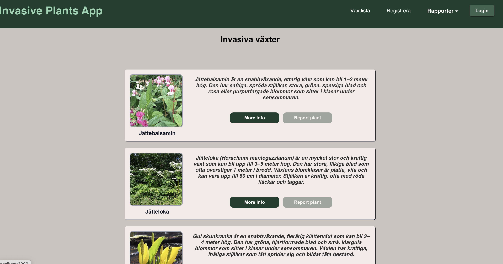
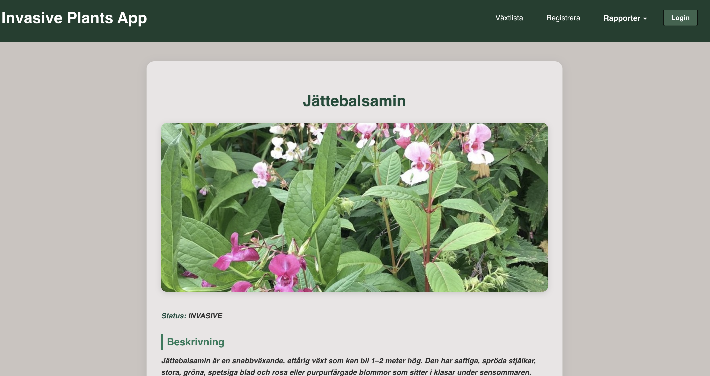
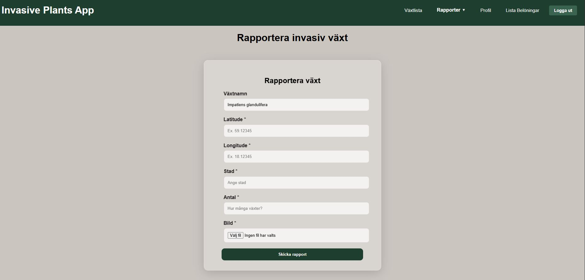
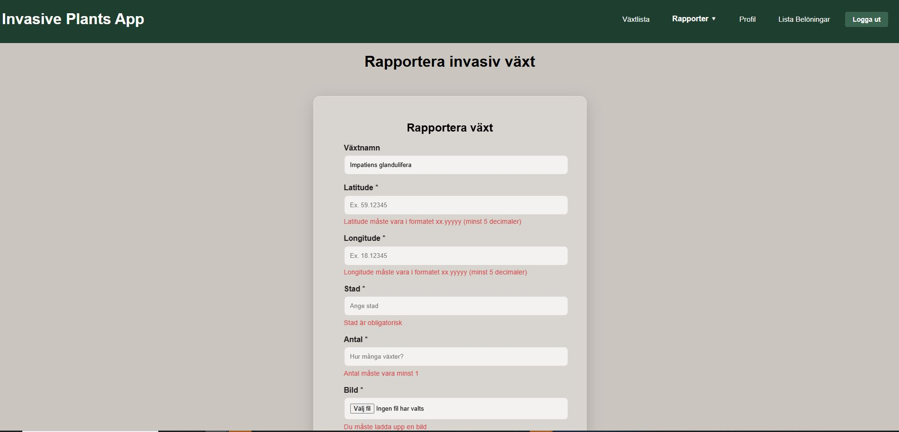
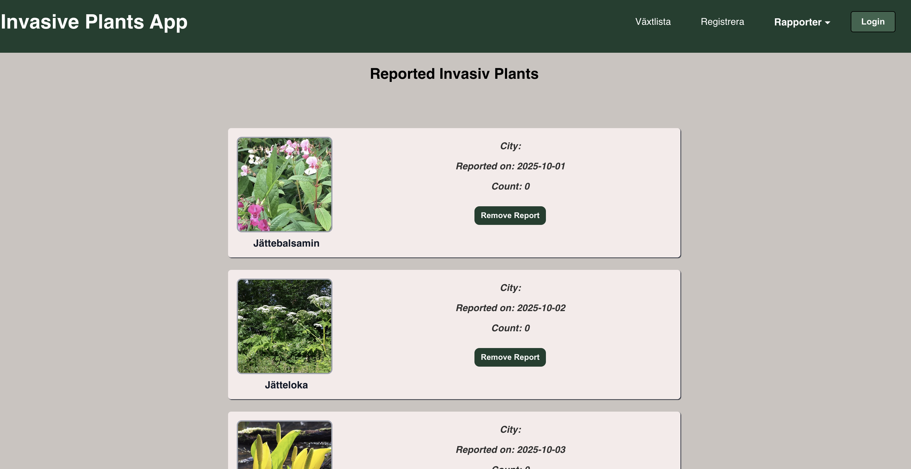
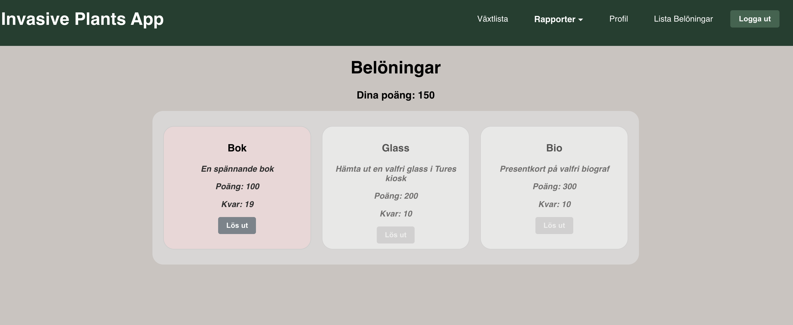
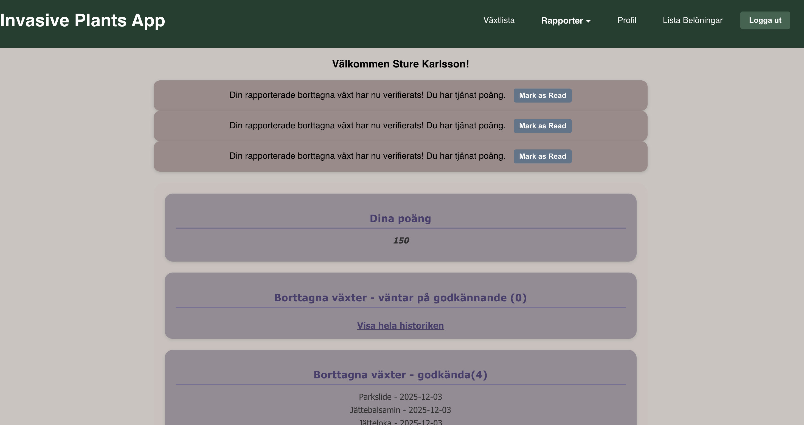
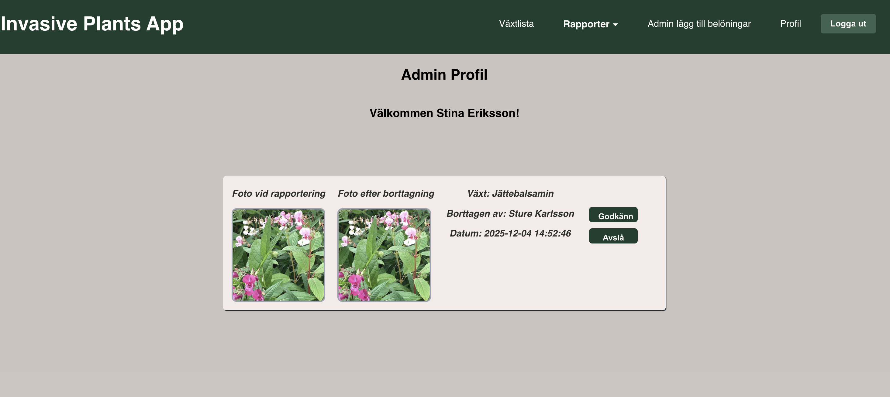

# Invasiva Växter – Rapportering & Belöningssystem

Ett fullstack-projekt av Filip, Carolin, Denise & Petra

## Översikt

Detta projekt är en interaktiv webbapplikation som syftar till att engagera allmänheten
i att identifiera, rapportera och ta bort invasiva växter.
Användare kan registrera fynd via koordinater,
ladda upp bilder och samla poäng som kan bytas mot belöningar.
Administratörer kan godkänna borttagningsrapporter och lägga till nya belöningar.

Målet är att bidra till biologisk mångfald genom att göra invasiva växter synliga
och skapa motivation hos användare att bidra till bekämpningen.

---

### Mål
- Uppmuntra allmänheten att rapportera invasiva växter.

- Visualisera fynd på karta och göra dem tillgängliga för allmänheten och kommuner.

- Motivera borttagning av växter genom poäng och belöningssystem.

- Samla in första datan om var invasiva växter förekommer.

---

### MVP
1. Växtlista
   

- Startsidan visar namn + bild av alla invasiva växter i databasen.

- Klick på kort → detaljsida med beskrivning, spridningsstatus, karaktärsdrag m.m.

- Felmeddelande vid laddningsfel.

- Inloggade användare får även knappar för rapportering direkt från kortet.

---

2. Växtens detaljsida
   
   - från växtlistan kan man klicka sig vidare på "more info" i växtens kort för att komma till detaljsida. 
   - På detaljsida finns information om en invasiv växt så som namn, beskrivning, spridnings status, bild samt biologiska karaktärsdrag
   och information om specifik borttagning.

---

3. Inloggningssystem

- Logga in med e-post och lösenord.

- Validering av inloggningsuppgifter.

- Misslyckad inloggning ger felmeddelande.

- Omdirigering till inloggning vid skyddade val + automatisk återställning till önskad sida.

---

4. Logga ut

- Logga ut-knapp/menyval.

- Sessionsdata rensas.

- Navigering tillbaka till startsidan.

---

5. Rapportera invasiv växt
   
   
- Inloggade användare kan registrera fynd genom ett formulär:

- Växten förifylls när formuläret öppnas från ett växtkort.

- Bild, koordinater och plats kan läggas till.

- Datum & tid läggs in automatiskt.

- Fält valideras och felmeddelanden visas vid fel format.

---

6. Lista över rapporterade växter
   
- Visa alla rapporterade fynd som klickbara kort.

- Kort innehåller: växtnamn, bild, plats, datum.

- Inloggade användare trycka på remove report för att komma till formuläret för att ta bort växt.

---

7. Rapportera borttagning av växt formulär

- Tillgängligt via respektive rapporterad post.

- Användaren laddar upp ”efterbild” som bevis.

- Status sätts automatiskt till "i väntan".

- Användaren får ett meddelande vid lyckad rapportering.

- Syns sedan på användarens profilsida.

---

8. Belöningssystem

- Admin kan lägga till belöningar med: namn, beskrivning, antal, kostnad i poäng

- Belöningar sparas och sidan uppdateras automatiskt.

- Användare kan se sina tillgängliga poäng och växla dem mot belöningar (endast om tillräckliga poäng finns).

---

9. Registrera användare

- Formulär med obligatoriska fält: förnamn, efternamn, e-post, lösenord.

- Validering av e-postformat och lösenordskrav.

- Unikt användarnamn kontrolleras i databasen.

- Krypterat lösenord.

- Felmeddelanden visas under respektive fält.

---

10. Profilsida (för inloggade användare)
    

Visar användarens:

- poäng

- personliga uppgifter

- registrerade fynd

- borttagna växter

- poänghistorik

- nofikationer om exempelvis ens post blivit godkänd och man fått poäng. 

- Felmeddelande om sidan inte kan laddas.

---

11. Admin profil
    

- Visar adminens uppgifter.

- Lista över borttagningsrapporter som väntar godkännande. 

- Admin ser en lista över borttagna växter i väntan på granskning.

- Kan öppna varje post, granska, godkänna/avslå.

- Vid godkännande får användaren poäng.

---
🧰Tech Stack
## Frontend

- ⚛️ React – komponentbaserat UI

- 🌐 Fetch API – kommunikation med backend

- 🎨 CSS – styling och layout

## Backend

- ☕ Java 17

- 🚀 Spring Boot – backendramverk

- 🔐 Spring Security – autentisering & behörigheter

- 🌐 Spring Web (REST) – RESTful API-endpoints

## Databas & ORM

- 🐬 MySQL – relationsdatabas

- 🧩 JPA / Hibernate – objekt-relationsmappning

- 🗺️ MySQL Workbench – ER-diagram & modellering

## Arkitektur & Integration

- 🔄 REST API – kommunikation mellan frontend & backend

- 📦 DTOs & Services – tydliga och separata lager

- 🧪 Validering – backend- och frontend-validering

- 🛠️ Maven – projekt- och beroendehantering

---
